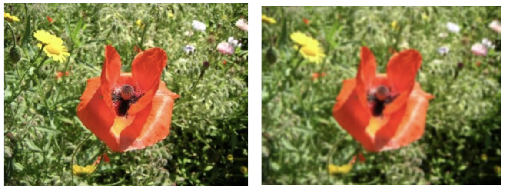
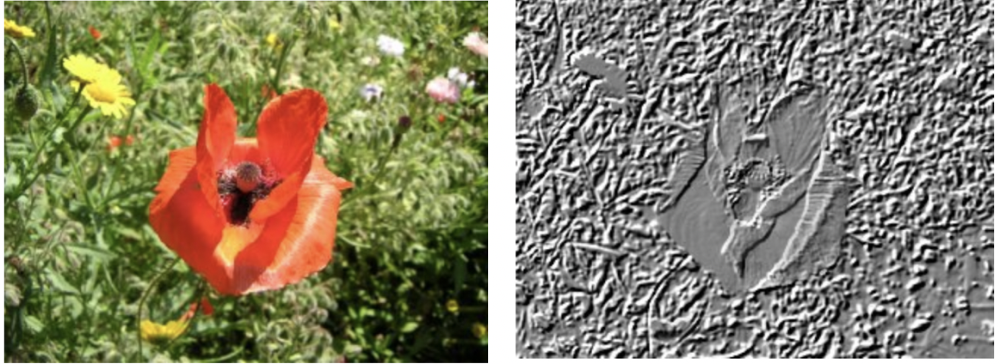
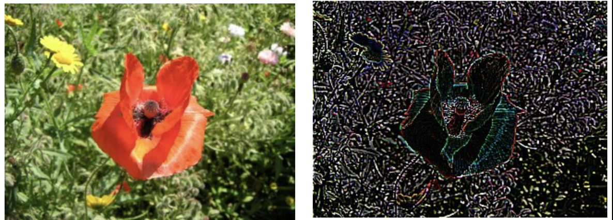

# BeautyPy
Three filters for image in Python

## Contributors

[Gilbert Lei](https://github.com/gilbertlei)

[Jielin Yu](https://github.com/jielinyu)

[Olivia Lin](https://github.com/olivia-lin)

## Overview
Nearly everyone has some experience with Image processing, which is around our daily life. For example, when we use iPhone's camera to take pictures, it allows us to choose a filter which can add some special effects on these pictures. While using these filters, people might have wondered how these special effects are realized.

We developed this package that performs digital image processing on .jpg images. People can use it to transform images into new images with some special effects. We started this project with three typical image processing effects, including blurring, embossing and sketching, and hope to advance and add more later on.  

## Functions
**Blur**  
This function performs convolution to make a blurred version of the original image so as to de-emphasize the sharpnesses between adjacent pixeles. By averaging every pixel with surroungding pixels, it remove details from the original image.

**Emboss**  
This function turns a colorful image into an embossment-type image. It replace each pixel of the image by either a highlight or a shadow. Low contrast areas are replaced by a gray background.

**Sketch**  
This function detects discontinuities in brightness within an image, finds the boundaries of objects and transform the color image into a gray image with highlighting on these boundaries.

## Similar packages in Python 

In python, package `OpenCv` can process images. 
Specifically, function `cv2.blur` works as the same as our function `blur`, which can blur the image. It is achieved by convolving the image with an average filter. [cv2.blur](https://docs.opencv.org/3.1.0/d4/d13/tutorial_py_filtering.html)

Function `cv2.cvtColor` works as the same as our function `emboss`, which can change image's color to gray. Additionally, parameter  ?cv2.COLOR_BGR2GRAY? can change image's color to gray. [cv2.cvtColor](https://extr3metech.wordpress.com/2012/09/23/convert-photo-to-grayscale-with-python-opencv/)

Function `cv2.Canny` works as the same as our function `sketch`, which can detect image's edge. 
[cv2.Canny](https://opencv-python-tutroals.readthedocs.io/en/latest/py_tutorials/py_imgproc/py_canny/py_canny.html)